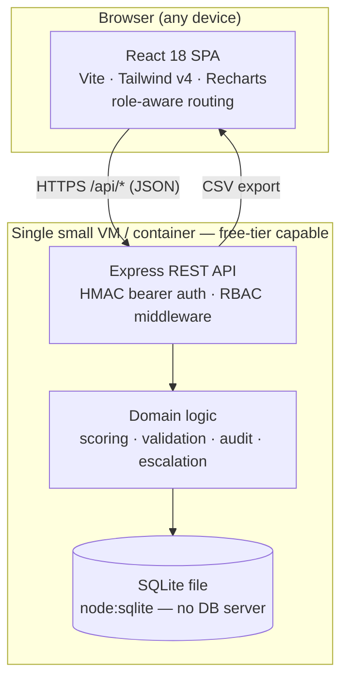

# Atomberg — Architecture

## System diagram



## Request flow

```
Login ──► POST /api/login ──► HMAC-signed token ──► stored client-side
Every call ──► Authorization: Bearer <token> ──► requireAuth ──► requireRole
            ──► route handler ──► domain logic ──► SQLite ──► JSON response
```

## Layers

| Layer | Responsibility |
|-------|----------------|
| **React SPA** | Role-aware UI (Employee / Manager / Admin), forms, validation feedback, charts |
| **Express API** | REST endpoints, authentication, role-based access control, CSV streaming |
| **Domain logic** (`server/lib`) | UoM scoring, weightage validation, audit logging, escalation rules |
| **SQLite** | Single-file relational store — `users`, `goal_sheets`, `goals`, `achievements`, `checkins`, `audit_log`, `escalations`, `cycles`, `thrust_areas` |

## Technology & hosting choices

- **SQLite via Node 24 `node:sqlite`** — no separate database server, no native
  compilation, no managed-DB bill. The entire dataset is one file; backup = copy.
- **Express** — minimal REST surface, no framework overhead.
- **React + Vite** — static build (`npm run build`) served by any CDN/static host;
  the API is a single Node process. Both fit comfortably in a free tier.
- **Stateless HMAC tokens** — no session store / Redis needed.
- **Cost posture** — 2 lightweight Node processes + 1 file. Scales vertically for
  an in-house portal; if multi-writer scale is ever needed, the data layer
  (`server/lib`) is isolated so SQLite → Postgres is a contained swap.

## External integrations (optional, env-driven)

| Integration | Mechanism | Activates when |
|-------------|-----------|----------------|
| **Microsoft Entra ID SSO** | OAuth2 auth-code flow (MSAL); Graph for profile, group→role, manager→hierarchy | `AZURE_*` env vars set |
| **Email** | SMTP via nodemailer — submission / approval / rejection / reminder events | `SMTP_*` env vars set |
| **Microsoft Teams** | Webhook card (Workflows Adaptive Card / connector MessageCard) with a deep link | configured in-app — Admin → Integrations |

Teams is set up by the organisation from the admin UI (`settings` table); email
and Entra hold secrets so they are env-driven. All three are pure add-ons:
unconfigured, the portal runs on local HMAC auth and records notification
dispatches as `skipped`. No external service is required to run or demo the core
portal — keeping the cost floor at zero.

## Security & governance

- Role-based access control on every mutating route (`requireRole`).
- Goal sheets lock on approval; edits afterwards require an audited Admin unlock.
- `audit_log` captures who/what/when for every goal, sheet, achievement and
  check-in change — post-lock edits are recorded distinctly.
