# Atomberg Goal Setting & Tracking Portal

> **Atomberg Hackathon 1.0 submission.**  
> A full-stack, production-deployed performance management platform covering the complete employee performance cycle — from goal creation through quarterly check-ins to audit-ready reporting and analytics.

**Live demo:** https://atomberg-portal-zwoq.onrender.com

> The instance sleeps after 15 min idle on Render's free tier — first request may take ~50 s to wake. The database auto-seeds on boot, so the portal always comes up fully populated.

---

## What this platform does

The portal manages the entire performance cycle for an organization:

1. **Employees** draft goal sheets — each goal has a thrust area, title, description, unit of measure, target, and weightage. The sheet must total exactly 100 % weightage before it can be submitted.
2. **Managers** review submitted sheets inline — they can adjust targets, add comments, and either approve (which locks the sheet) or return it for rework.
3. **Once approved**, employees log quarterly achievements (Q1–Q4) against each goal. Managers record check-in comments per quarter.
4. **Admins / HR** run reports, inspect the full audit trail, trigger escalation checks, configure integrations, and export CSV achievement data.

Every action — goal creation, approval, post-lock edit, unlock, check-in — is recorded in an immutable audit log. Email and Teams notifications fire automatically on goal lifecycle events.

---

## Screenshots

### Login — one-click demo access + Microsoft SSO

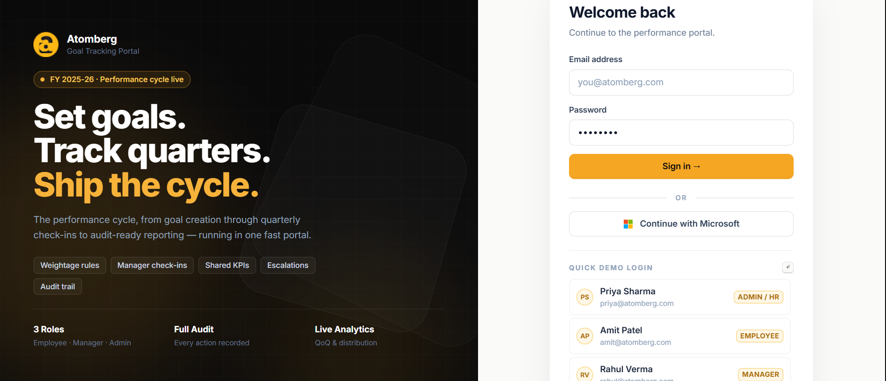

Three demo accounts are available for instant one-click login. "Continue with Microsoft" (Microsoft Entra ID SSO) also supported — hover the button to see which Microsoft account maps to which role.

---

### Employee Dashboard — personal goal sheet overview

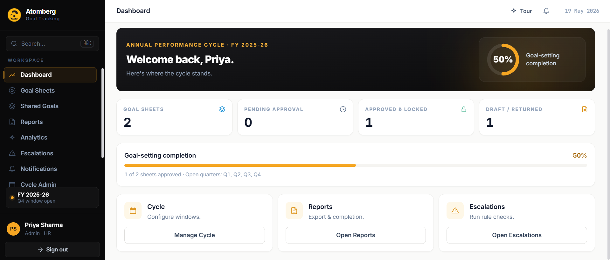

Employees see their goal sheet status, current quarter progress, and a weightage summary at a glance.

---

### Goal Sheet — weightage rules enforced live

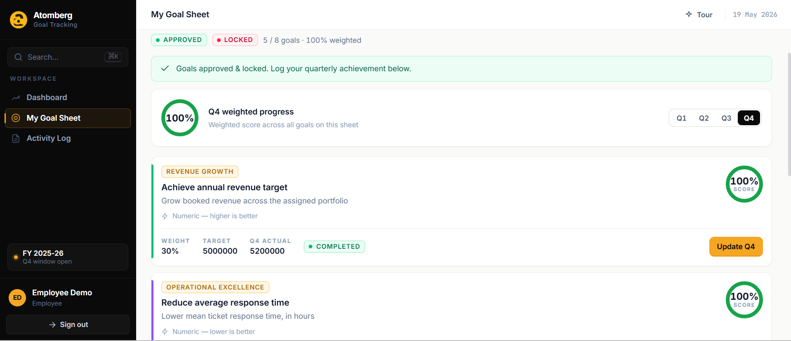

The goal sheet enforces all BRD rules in real-time:
- Total weightage must equal exactly **100 %**
- Each goal must be **≥ 10 %**
- Maximum **8 goals** per sheet
- A live meter shows remaining weightage — submit is blocked until 100 %

---

### Sheet Detail — achievements, UoM scoring, check-ins

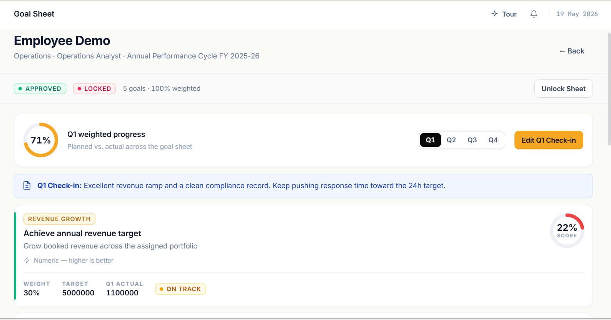

After manager approval, employees log quarterly achievements. Each goal computes a weighted score using the UoM-specific formula (see scoring section below). Manager check-in comments appear inline.

---

### Manager Team View — approve, return, inline edit

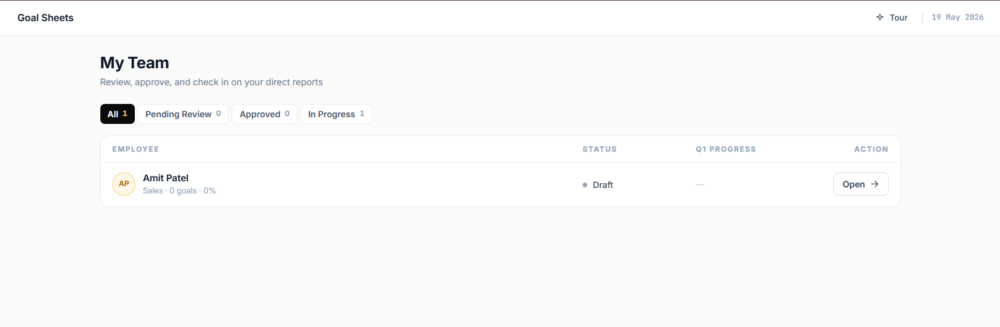

Managers see all direct-report sheets. They can edit targets/descriptions inline before approving. Approval locks the sheet; "Return for Rework" sends it back with a mandatory reason.

---

### Analytics — four dashboards

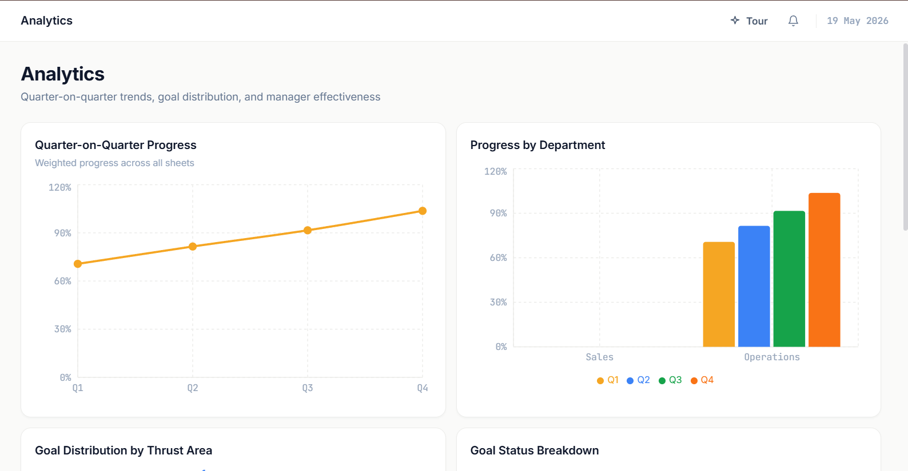

Four live analytics views (lazy-loaded to keep initial bundle small):
- **QoQ Trend** — quarter-over-quarter score movement across the organisation
- **Department Progress** — completion rate and average score by department
- **Goal Distribution** — breakdown by thrust area and UoM type
- **Manager Effectiveness** — approval cycle time and return rate per manager

---

### Reports — completion dashboard + CSV export

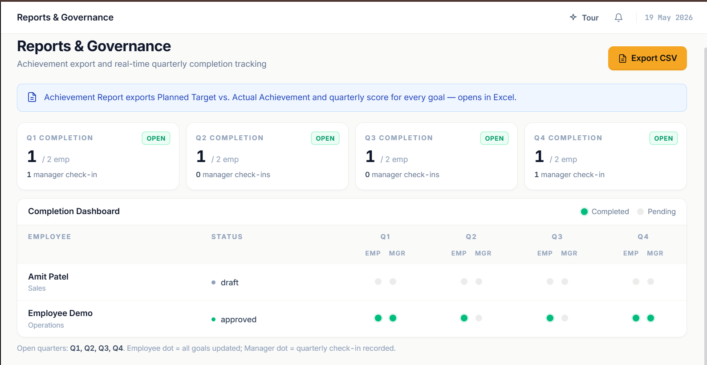

Admin reports show overall completion rates, goal-status breakdowns, and an exportable CSV covering every employee's quarterly achievements and computed scores.

---

### Audit Trail — every action recorded

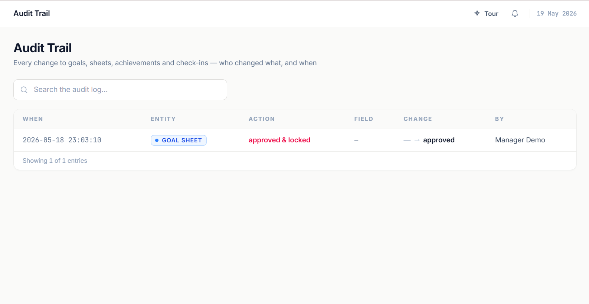

Every state change is recorded with actor, timestamp, and before/after diff. Post-lock edits are flagged distinctly. Admin sheet-unlock operations are themselves audited.

---

### Escalations — rule-based, three severity levels

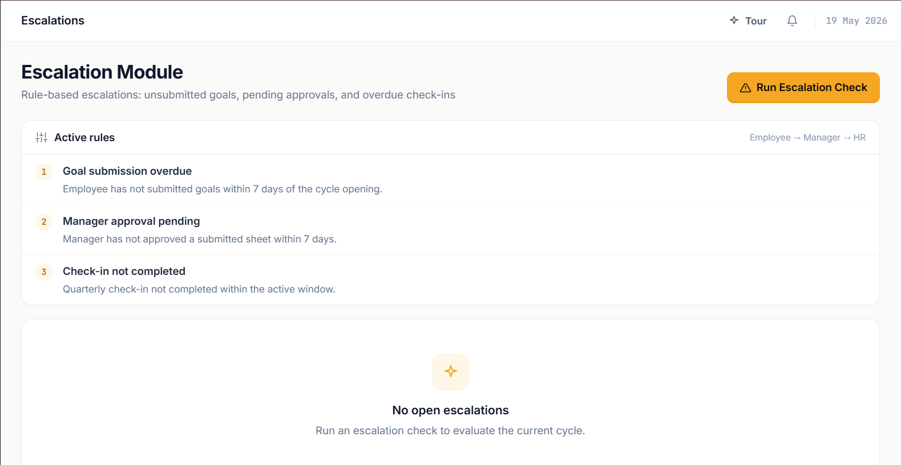

Three configurable escalation rules fire automatically:
- **L1 (≤ 14 days overdue)** — gentle nudge to employee
- **L2 (≤ 28 days overdue)** — manager loop-in
- **L3 (> 28 days overdue)** — HR / admin escalation

---

### Integrations — Teams webhook + SMTP email

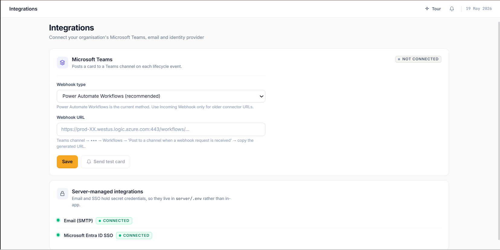

Admins configure the Microsoft Teams webhook URL in-app (no redeploy needed). SMTP credentials are env-driven. A test-card button validates the webhook before enabling. Every dispatch — sent, failed, or skipped — is recorded in a Notifications log.

---

### Live Email Notifications — received in production

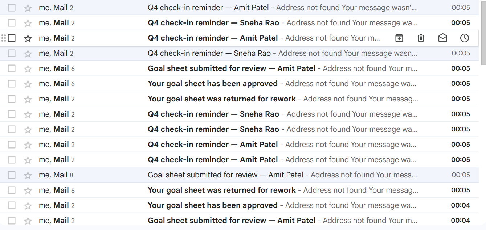

Notification emails received in a live Gmail inbox during testing: Q4 check-in reminders, goal submitted, goal approved, goal returned for rework. These are real SMTP sends from the production deployment — not mocked.

---

## Feature coverage against the problem statement

### Phase 1 — Goal creation & approval

| BRD requirement | Implementation |
|-----------------|----------------|
| Thrust area, title, description per goal | `goals` table; five fields captured on creation |
| 5 unit-of-measure types | `numeric_max` (Numeric↑), `numeric_min` (Numeric↓), `percent`, `timeline`, `zero` — each with its own scoring formula |
| Weightage = 100 %, each ≥ 10 %, max 8 goals | Enforced in both client (live meter, disabled submit) and server (API validates before state change) |
| Manager inline edit before approval | Manager can patch target/description/weightage; all edits logged |
| Approve → lock sheet | `status = approved`, `locked_at` timestamp set; subsequent employee edits go to audit with `post_lock = true` |
| Return for rework with reason | `status = rework`, mandatory `reason` field stored and shown to employee |
| Shared departmental KPIs | Shared goals carry a `shared_origin_id`; updates to the parent propagate to all copies atomically in a single SQLite transaction |

### Phase 2 — Quarterly tracking

| BRD requirement | Implementation |
|-----------------|----------------|
| Quarterly achievement capture | `quarterly_achievements` table; one row per goal × quarter |
| Goal status (Not Started / On Track / Completed) | Derived from achievement entries; exposed per goal and in aggregate |
| Manager check-ins per quarter | `checkins` table; manager submits a comment + rating per employee × quarter; configurable check-in windows |
| Computed UoM progress scores | See scoring formula table below |

#### UoM scoring formulas

| UoM | Formula | Cap |
|-----|---------|-----|
| Numeric↑ (higher = better) | Achievement ÷ Target | 1.5× target |
| Numeric↓ (lower = better) | Target ÷ Achievement | 1.5× |
| Percent | Achievement ÷ Target | 1.5× |
| Timeline | On/before deadline → 100 %; after → 50 % | — |
| Zero-based | Actual = 0 → 100 %; any non-zero → 0 % | — |

Weighted score = Σ (goal score × goal weightage).

### Reporting & governance

| BRD requirement | Implementation |
|-----------------|----------------|
| CSV achievement report | Single-click export; includes employee, goal, UoM, target, Q1–Q4 actuals, computed scores |
| Completion dashboard | Aggregate view: % sheets submitted/approved, goal status distribution |
| Full audit trail | `audit_log` table; every write operation appends a record with actor, action, entity, before/after JSON; post-lock edits flagged |
| Admin sheet unlock | Unlock itself is audited; admin must provide a reason (defaulted to mock reason for now) |

---

## Bonus features

### Microsoft Entra ID SSO (Bonus 5.1)

Implemented via **MSAL Node** (OAuth2 authorization-code flow):

1. `/api/auth/sso/login` redirects to Microsoft with `openid profile email` + `User.Read` + `GroupMember.Read.All` scopes.
2. Microsoft redirects back to `/api/auth/sso/callback` with an auth code.
3. The server exchanges the code for tokens, calls **Microsoft Graph** (`/me`, `/me/memberOf`, `/me/manager`) to retrieve profile, AAD group membership, and reporting-line.
4. Group membership is mapped to portal role: `AtombergAdmin` → `admin`, `AtombergManager` → `manager`, default → `employee`.
5. A short-lived HMAC-signed SSO token is issued, redirected to the React client, and exchanged for a standard bearer token — keeping the OAuth redirect chain away from the SPA.

The SSO button only appears when `AZURE_*` env vars are set (checked via `/api/auth/sso/status`). Without credentials the portal degrades gracefully to local auth.

### Email & Teams notifications (Bonus 5.2)

Four lifecycle events trigger notifications:

| Event | Email | Teams |
|-------|-------|-------|
| Goal sheet submitted | Manager notified | Card posted to channel |
| Sheet approved | Employee notified | Card posted |
| Sheet returned for rework | Employee notified | Card posted |
| Quarterly check-in reminder | Employees with pending achievements notified | Card posted |

**Email** — nodemailer over SMTP; HTML + plain-text body, `From` address configurable.  
**Teams** — supports both **Power Automate Workflows** (Adaptive Card v1.4) and classic **Incoming Webhook** (MessageCard) — selectable per webhook URL.  
**Governance** — every dispatch (sent / failed / skipped) is recorded in the `notifications` table and visible to admins in the Notifications log. Nothing breaks if neither channel is configured — records are written as `skipped`.

### Escalations (Bonus 5.3)

Three rule types, each configurable by admin:

| Rule | Trigger condition | Levels |
|------|-------------------|--------|
| Goal not submitted | Sheet in draft past deadline | L1 → L2 → L3 |
| No quarterly update | Achievement missing for current quarter | L1 → L2 → L3 |
| No manager check-in | Check-in window passed without manager comment | L1 → L2 → L3 |

Levels are determined by how many days overdue: L1 ≤ 14 d, L2 ≤ 28 d, L3 > 28 d. Each run is idempotent — re-running doesn't create duplicate records.

### Analytics (Bonus 5.4)

Four dashboards built with **Recharts**, lazy-loaded behind a dynamic `import()` so they don't inflate the main bundle:

| Dashboard | What it shows |
|-----------|---------------|
| QoQ Trend | Line chart of average weighted score per quarter across the org |
| Department Progress | Bar chart — completion rate and average score per department |
| Goal Distribution | Pie / bar — goals by thrust area and by UoM type |
| Manager Effectiveness | Table — approval cycle time (days from submit → approve) and return rate per manager |

---

## Technology choices — rationale

### Node.js built-in SQLite (`node:sqlite`)

Available from Node 22.5. No separate DB process, no ORM, no binary dependency — the database is a single file. For a single-org internal tool this is the right trade-off: zero ops overhead, instant startup on Render's free tier, synchronous `DatabaseSync` API that eliminates async/await noise in route handlers, and full ACID transactions for operations like shared-KPI propagation.

### HMAC bearer tokens (stateless auth)

No session store, no Redis dependency. Each token encodes `{ userId, role, iat, exp }` and is verified with a server-side secret. Stateless tokens survive server restarts (which happen frequently on free-tier hosts) without logging anyone out.

### React + Vite + Tailwind v4

Vite gives sub-second HMR in dev and fast production builds. Tailwind v4's CSS-first config (`@theme`) means design tokens live in CSS, not JS config — better IDE support, smaller build output. Analytics components are behind a dynamic `import()` (code-split) — the heaviest Recharts bundle doesn't land on users who never open the analytics tab.

### Single-process production deployment

`npm run build` in `client/` outputs a `dist/` folder; `server/index.js` serves it as static files and mounts the API at `/api`. One Render web service, one build command, one start command. No separate CDN origin or proxy needed at this scale.

### Auto-seed pattern

On boot, the server checks `SELECT COUNT(*) FROM users`. If zero, it runs `seed.js` synchronously before accepting requests. This means the live demo is always populated — no manual step, no migration runner, no separate seed job.

---

## Evaluation parameter mapping

| Parameter | What we built |
|-----------|---------------|
| **Goal creation & approval workflow** | Full phase 1 — 5 UoM types, weightage enforcement (client + server), inline manager edit, approve/lock, return with reason |
| **Quarterly tracking** | Phase 2 — per-goal achievement entry, UoM-specific score computation, manager check-in comments, configurable windows |
| **Reporting & governance** | CSV export, completion dashboard, full immutable audit trail, audited unlock |
| **Scalability / code quality** | Synchronous SQLite (no ORM), stateless tokens (no session store), lazy-loaded analytics, single deployable artefact |
| **Bonus — SSO** | Microsoft Entra ID via MSAL, Graph profile + group → role + manager hierarchy |
| **Bonus — Notifications** | SMTP email + Teams Adaptive Card, 4 lifecycle events, governance log |
| **Bonus — Escalations** | 3 rules × 3 severity levels, idempotent runs |
| **Bonus — Analytics** | 4 dashboards, lazy-loaded Recharts, QoQ + dept + distribution + manager |

---

## Demo accounts

### One-click local login

| Role | Email | Password |
|------|-------|----------|
| Admin / HR | `priya@atomberg.com` | `password` |
| Manager | `rahul@atomberg.com` | `password` |
| Employee | `amit@atomberg.com` | `password` |

`amit@atomberg.com` starts with an empty draft sheet — ideal for demonstrating goal creation live.

### Suggested demo journey

1. **Employee** (`amit@`) — add 3–4 goals, watch the weightage meter, submit at 100 %.
2. **Manager** (`rahul@`) — open `amit@`'s sheet, adjust a target, approve and lock.
3. **Employee** (`amit@`) — log Q3 achievement on the now-locked sheet.
4. **Manager** (`rahul@`) — record a Q3 check-in comment.
5. **Admin** (`priya@`) — run an escalation check, export the CSV report, inspect the audit trail, view the Notifications log, open Analytics.

### Microsoft Entra ID SSO accounts

Hover the "Continue with Microsoft" button on the login page to see which Microsoft account maps to which role. Passwords are supplied separately with the hackathon submission.

| Role | Microsoft account |
|------|-------------------|
| Admin | `admin@rickysingh11103gmail.onmicrosoft.com` |
| Manager | `manager@rickysingh11103gmail.onmicrosoft.com` |
| Employee | `employee@rickysingh11103gmail.onmicrosoft.com` |

---

## Architecture

See [`ARCHITECTURE.md`](ARCHITECTURE.md) for the full system diagram and data-flow description.

**Summary:**
- Single Node.js process in production — Express serves the built SPA (`dist/`) and mounts the API at `/api`.
- SQLite database file alongside the server process (auto-seeded on boot).
- HMAC bearer tokens — no session store, survives restarts.
- Email / Teams notifications are fire-and-forget: dispatched after the HTTP response is sent, so they never block the API.
- Render auto-deploys on push to `main` via the `render.yaml` blueprint.
